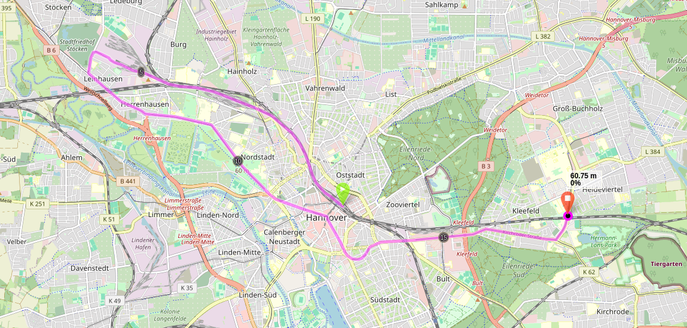

Zu jeder Fahrt siehst du - in der Regel - eine Karte, die den Verlauf der Fahrt anzeigt.
Wir haben Kartendaten ursprünglich von den [Fahrplandaten](/features/timetable) übernommen, die wir nutzen.
Im April 2025 haben wir auf [Transitous als neues Backend umgestellt](/features/timetable).
Bisher unterstützen wir die Fahrtverläufe noch nicht, daher werden nur Karten von Station zu Station angezeigt.

Nach einem Checkin versuchen wir mit Hilfe von [BRouter](https://brouter.de/brouter-web/) eine exaktere Route entlang
der Stationen zu berechnen.
Leider ist das nicht immer möglich, da die Koordinaten der Haltestellen nicht immer an den für die Fahrten genutzten
Gleisen liegen.

#### BRouter und die weiteren Probleme...

Nach einem Checkin versuchen wir die Karte mit Hilfe
von [BRouter](https://brouter.de/brouter-web/#map=6/51/10/standard&profile=rail) zu verbessern.
Dazu lassen wir die Strecken mit allen bekannten Zwischenhalten neu berechnen.
Das kann jedoch auch zu Fehlern führen, wenn z.B. auf längeren Strecken keine Zwischenhalte bekannt sind und daher der
Streckenverlauf nicht korrekt abgebildet werden kann.

In Ballungszentren mit vielen getrennten Schienensystemen kann es außerdem dazu kommen, dass die Karte bei manchen
Zwischenhalten eine falsche Haltestelel als nächste auswählt und daher ein komplett falscher Streckenverlauf angezeigt
wird.

**Beispiel: Du fährst mit der S-Bahn Hannover von Hannover Hbf nach Hannover Karl-Wiechert-Allee.**
Faktisch ist das eine Fahrt durchgehend auf einer Eisenbahnstrecke.
Die Haltestelle Karl-Wiechert-Allee ist jedoch sehr nah an einer Stadtbahnhaltestelle.
Da die Koordinaten der Haltestelle leider nicht eindeutig genug sind versucht BRouter also die Strecke über die
Stadtbahngleise und den Übergangspunkt von Eisenbahn- zu Stadtbahnstrecke in Leinhausen zu routen.
Das führt zu einer entsprechend langen, wilden Streckenführung.

<small>
    &copy; <a href="https://www.openstreetmap.org/copyright">OpenStreetMap contributors</a>
    &copy; <a href="https://github.com/abrensch/brouter">BRouter</a>
</small>