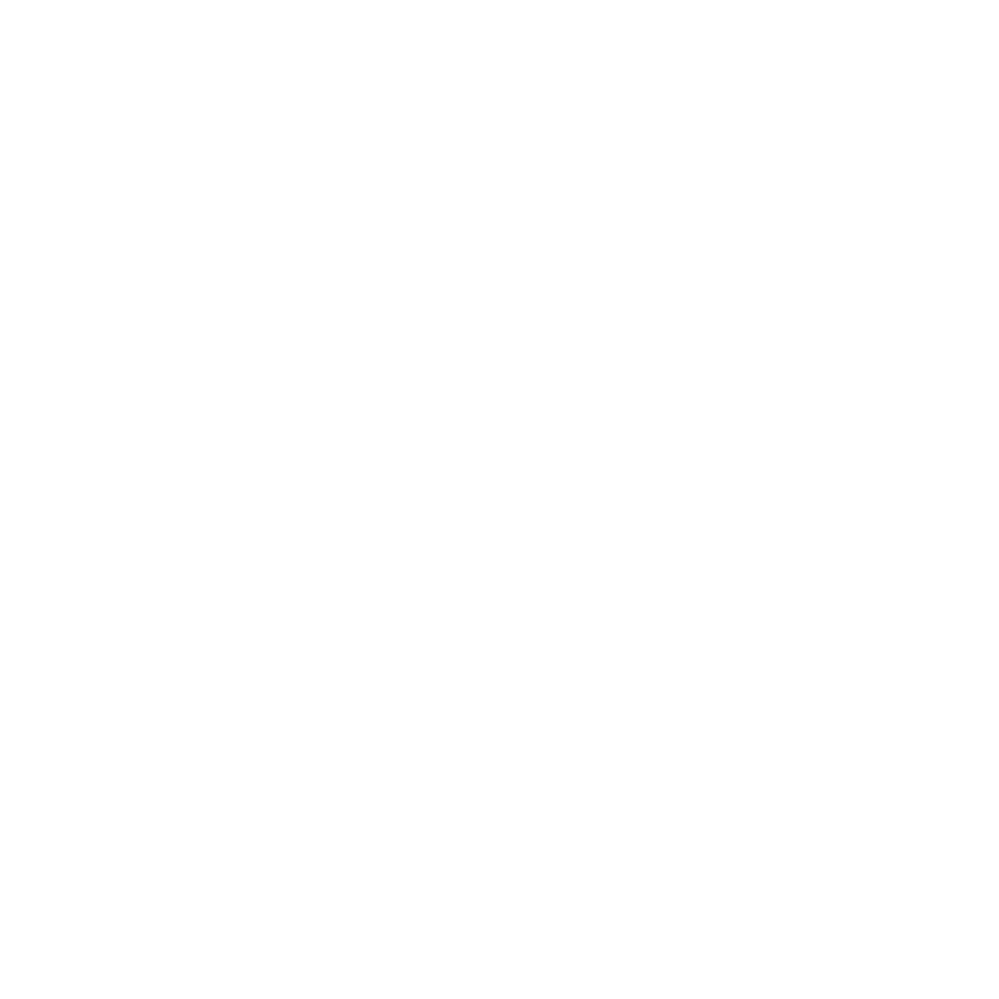

An dieser Stelle möchten wir unser einzigartiges und komplexes Corporate Design offenbaren.
Wir wissen, dass die Gestaltung eines einprägsamen Markenauftritts eine Wissenschaft für sich ist. Deshalb haben
wir alles daran gesetzt, ein Corporate Design zu entwickeln, das jeden Designer vor Neid erblassen lässt.
Und hier ist das Geheimnis:

#### Das Träwelling-Logo

| Image                                                                                            | Description                           |
|--------------------------------------------------------------------------------------------------|---------------------------------------|
|           | Logo (vector) mit rotem Hintergrund   |
|  | Weißes Logo (vector) ohne Hintergrund |

#### Die Farbe von Träwelling

Farben sind wichtig, und wir haben uns für eine Farbe entschieden, die alles ausdrückt, was Träwelling darstellt.
Diese Farbe ist nicht nur irgendein Farbton – sie ist **DIE** Farbe.
Sie zieht sich durch unser gesamtes Erscheinungsbild und sorgt dafür, dass Sie uns nie vergessen.

Also, lehnen Sie sich zurück, bewundern Sie unser Logo und lassen Sie sich von unserer Farbe inspirieren.
Denn bei Träwelling wissen wir: Weniger ist mehr.
Außer bei Reisen, da ist mehr natürlich immer besser.

Träwelling-Rot #C72730
<small>angelehnt an Verkehrsrot</small>