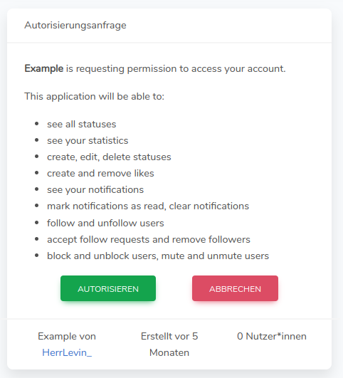
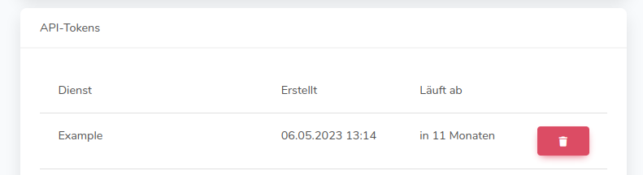

Träwelling selbst bietet derzeit leider keine Apps an.
Die einzige offizielle Möglichkeit, Träwelling zu nutzen besteht derzeit nur über die
Webseite [traewelling.de](https://traewelling.de).
Alle weiteren Seiten oder Apps, mit denen du mit Träwelling interagieren kannst, sind keine offiziellen Entwicklungen
von uns.

## Drittanbieter-Apps

Träwelling bietet eine kostenfreie [API](https://de.wikipedia.org/wiki/API) an, über welche Drittentwickler\*innen mit
dem Dienst kommunizieren können.
Eine Liste aller (bekannten) Projekte findest du [hier](/community/list-of-third-party-apps/).

### Autorisierung


Bitte beachte, dass wir bei einer Nutzung von Drittanbieter-Apps keine Handhabe mehr über den weiteren Verlauf deiner
Daten haben.
Solltest du bei uns deinen Account löschen, können die Daten bei Drittanbietern weiterbestehen, ohne dass wir etwas
daran ändern können.
Überlege dir bitte gut, welchen Anwendungen du Zugriff auf deine Daten geben möchtest!


Eine Autorisierung von Drittanbieter-Apps erfolg über das sogenannte OAuth-Verfahren.
Hierbei bestätigst du in einem Dialog die angeforderten Zugriffsrechte, um die Anwendung verwenden zu können.
Vereinzelt gibt es noch Anwendungen, welche dich direkt nach deinem Passwort fragen.
Nach und nach wird diese Funktion abgeschafft werden. Die Anmeldung mittels Autorisierungsanfrage ist die von uns
empfohlene Variante.

### Entfernen von Anwendungszugriffen

Wenn du sichergehen möchtest, dass Drittanwendungen keinen zugriff mehr auf deine Daten haben, kannst du den zugriff in
deinen [Einstellungen](https://traewelling.de/settings) widerrufen.
Klicke hierfür unter dem Punkt „API-Tokens“ in der Zeile der zu entfernenden Anwendung auf den roten Button mit
Mülleimersymbol.

Da du Anwendungen auf mehreren Geräten installieren kannst, kann es sein, dass diese auch mehrfach in den Einstellungen
aufgelistet sind.
Eventuell musst du eine Anwendung mehrfach aus der Liste löschen.
Sobald diese Anwendung nicht mehr aufgelistet ist, hat sie definitiv keinen Zugriff mehr auf deine Daten.


Bitte beachte, dass Anwendungen, die über Benutzername und Passwort authentifiziert werden, als „Träwelling Personal
Access Client“ aufgeführt werden.
Du kannst Anwendungen, die diese Authentifizierungsmethode verwenden, nicht unterscheiden.
