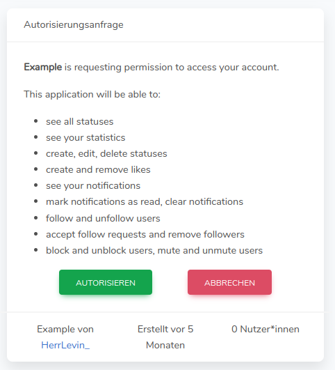
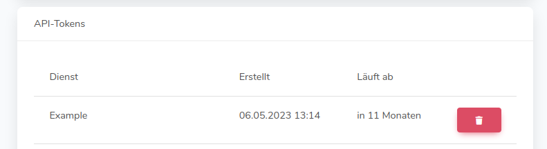

Unfortunately, Träwelling itself does not currently offer any apps.
The only official way to use Träwelling at the moment is through the website [https://traewelling.de]().
All other sites or apps that allow you to interact with Träwelling are not official developments from us.

## Third-party apps
Träwelling offers a free [API](https://en.wikipedia.org/wiki/API) that allows third-party developers to communicate with the service.
A list of all (known) projects can be found [here](/en/community/list-of-third-party-apps/).

### Authorization


Please note that if you use third-party apps, we no longer have any control over your data usage.
If you delete your account with us, the data may continue to exist with third-party providers without us being able to change anything.
Please think carefully about which apps you want to give access to your data!


Third-party apps are authorized via the OAuth procedure.
You confirm the requested access rights in a dialog to be able to use the application.
There are still some apps that ask you for your password directly.
Gradually, this function will be abolished.
The login via authorization request is the variant we recommend.

### Remove application access
If you want to make sure that third-party applications no longer have access to your data, you can revoke the access in your [settings](https://traewelling.de/settings).
To do this, click on the red button with the trash can icon under the item "API tokens" in the line of the application to be removed.

Since you can install apps on multiple devices, they may be listed multiple times in the settings.
You may need to delete an app from the list multiple times.
Once this app is no longer listed, it will definitely no longer have access to your data.


Please note that applications authenticated via username & password are listed as "Träwelling Personal Access Client".
You won't be able to distinguish any app using this authentication method.
